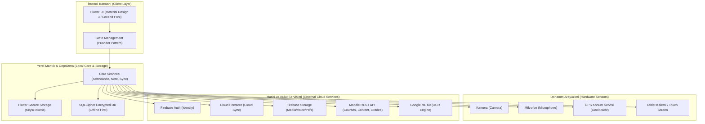
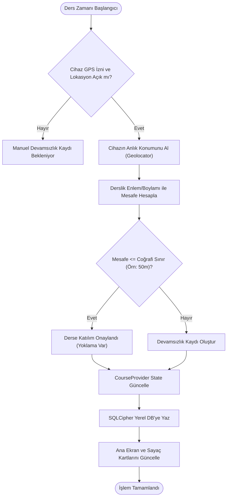
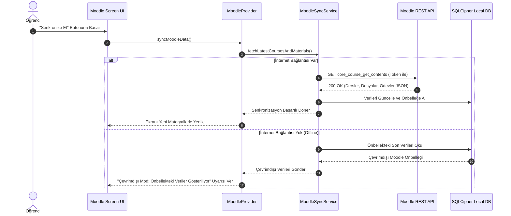
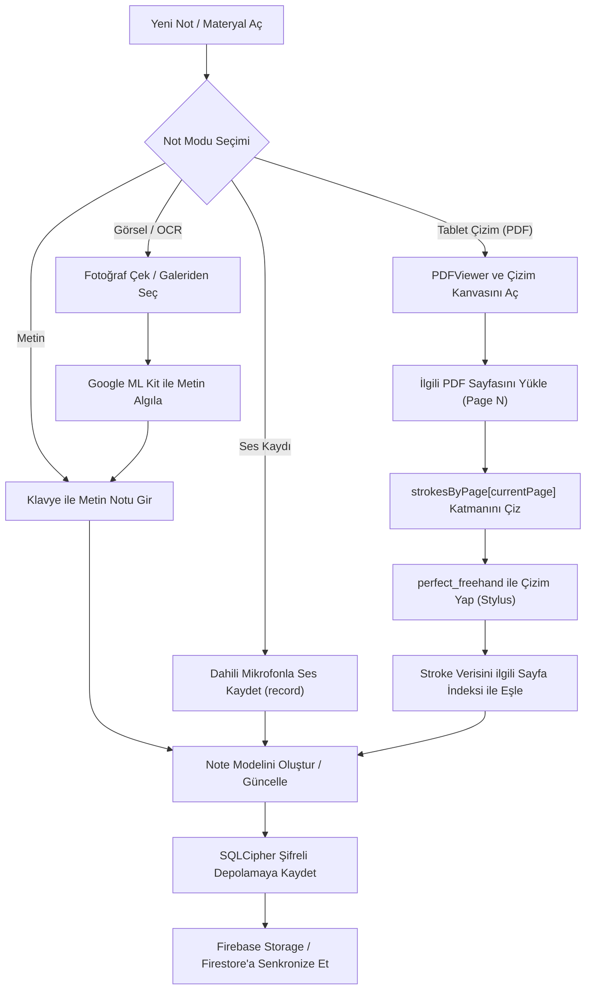
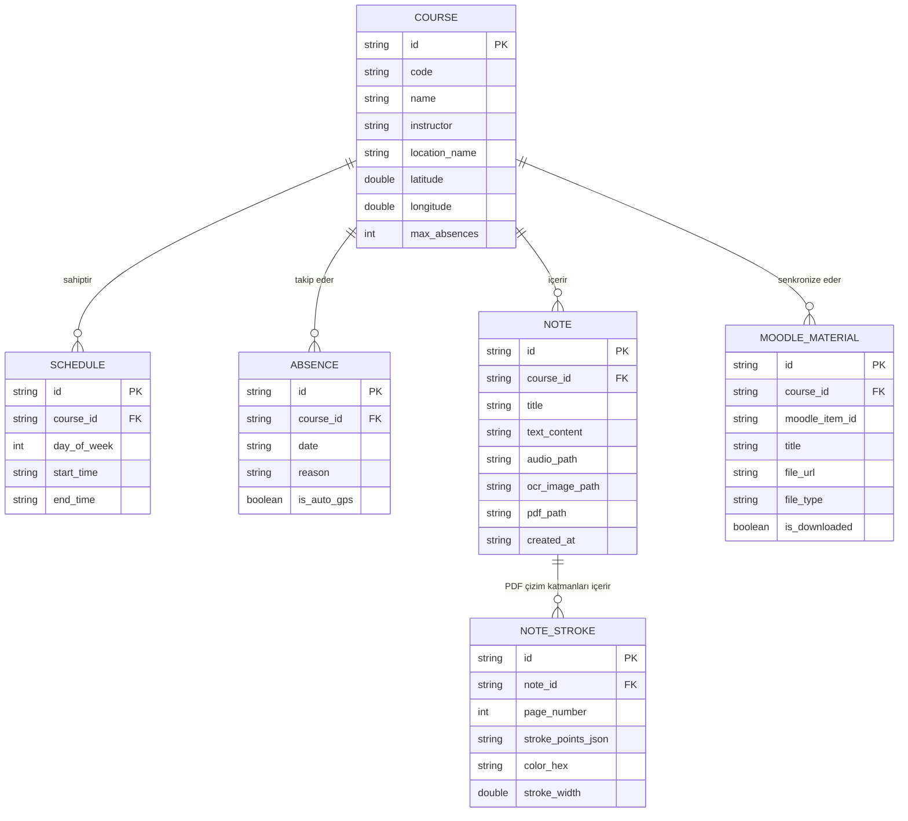

# LessonTracker — Yazılım Gereksinim Spesifikasyonu (SRS)
**Software Requirements Specification (ISO/IEC/IEEE 29148 & IEEE 830 Standartlarına Uygun)**

- **Proje Adı:** LessonTracker
- **Sürüm:** 1.1.0
- **Tarih:** 1 Ağustos 2026
- **Durum:** Güncellenmiş Mimari ve İş Akış Diyagramları Destekli Spesifikasyon

---

## 1. Giriş (Introduction)

### 1.1 Amaç
Bu doküman, **LessonTracker** (Çok Modlu Ders ve Not Takip Uygulaması) yazılım sisteminin fonksiyonel ve fonksiyonel olmayan gereksinimlerini, mimari yapısını, harici arayüz entegrasyonlarını, iş akışlarını ve güvenlik kriterlerini görsel diyagramlarla destekleyerek tanımlamak üzere hazırlanmıştır. Doküman; geliştiriciler, test mühendisleri ve proje paydaşları için ortak bir referans kaynağı oluşturur.

### 1.2 Kapsam
LessonTracker; öğrencilerin ders programlarını düzenlemelerini, devamsızlık durumlarını konum bazlı otomasyonla takip etmelerini, Moodle LMS sistemlerinden ders materyali ve ödev bilgilerini senkronize etmelerini, çok modlu notlar (metin, ses, OCR/görsel, el yazısı/çizim) almalarını ve PDF materyalleri üzerinde dijital defter deneyimi yaşamalarını sağlayan çok platformlu (Flutter tabanlı) bir mobil/web uygulamasıdır.

### 1.3 Tanımlar ve Kısaltmalar
| Kısaltma | Açıklama |
|---|---|
| **SRS** | Software Requirements Specification (Yazılım Gereksinim Spesifikasyonu) |
| **LMS** | Learning Management System (Öğrenme Yönetim Sistemi - Moodle) |
| **OCR** | Optical Character Recognition (Optik Karakter Tanıma) |
| **E2EE** | End-to-End Encryption (Uçtan Uca Şifreleme) |
| **KVKK** | Kişisel Verilerin Korunması Kanunu |
| **CRUD** | Create, Read, Update, Delete (Oluştur, Oku, Güncelle, Sil) |
| **GPS** | Global Positioning System (Küresel Konumlama Sistemi) |

### 1.4 Referanslar
1. [`docs/AUDIT_REPORT_2026-07-17.md`](AUDIT_REPORT_2026-07-17.md) — Sistem Denetim Raporu
2. [`docs/IMPLEMENTATION_PLAN.md`](IMPLEMENTATION_PLAN.md) — İyileştirme ve Aksiyon Planı
3. [`app/pubspec.yaml`](../app/pubspec.yaml) — Bağımlılık ve Yapılandırma Manifestosu

---

## 2. Genel Açıklama ve Mimari Diyagramlar (Overall Description)

### 2.1 Ürün Perspektifi ve Sistem Mimarisi
LessonTracker, istemci tarafında Flutter (Dart) framework'ü ile geliştirilmiş, yerel SQLCipher (şifreli SQLite) veritabanı ile çevrimdışı öncelikli (offline-first) çalışan, arka planda Firebase (Auth, Firestore, Storage, Cloud Functions) ve Moodle REST API servisleri ile senkronize olan hibrit bir sistemdir.

#### 🏛️ Şekil 2.1: Genel Sistem Mimari Diyagramı


---

### 2.2 Kullanım Senaryosu Diyagramı (Use Case Diagram)
Uygulama üzerindeki birincil aktör olan öğrencilerin gerçekleştirdiği ana işlevsel etkileşimler aşağıda modellenmiştir.

#### 👥 Şekil 2.2: Kullanım Senaryoları (Use Cases)
```mermaid
graph LR
    Actor["Öğrenci (Birincil Kullanıcı)"]

    subgraph "LessonTracker Kullanım Senaryoları"
        UC1["Ders Ekleme ve Zaman Tablosu Görüntüleme"]
        UC2["Moodle Hesabı Bağlama ve Senkronizasyon"]
        UC3["Devamsızlık Takibi (Manuel / Otomatik GPS)"]
        UC4["Çok Modlu Not Alma (Metin, Ses, OCR)"]
        UC5["PDF / Defter Üzerinde Çizim Yapma (Stylus)"]
        UC6["Biyometrik Giriş Yapma (Face ID / Touch ID)"]
    end

    Actor --> UC1
    Actor --> UC2
    Actor --> UC3
    Actor --> UC4
    Actor --> UC5
    Actor --> UC6

    UC3 ..> |"İçerir (Includes)"| UC7["GPS Coğrafi Sınır (Geofence) Kontrolü"]
    UC4 ..> |"Genişletir (Extends)"| UC8["Görsel Belgeden OCR ile Metin Çıkarma"]
    UC2 ..> |"İçerir (Includes)"| UC9["Moodle REST API Token İçe Aktarma"]
```

---

## 3. Sistem Özellikleri ve İş Akış Diyagramları

### 3.1 Ders & Çakışma Yönetimi
- **FR-1.1:** Kullanıcı yeni bir ders oluşturabilmeli, ders adı, kodu, öğretim elemanı, sınıf konumu (enlem/boylam ve metin) ve saat bilgilerini girebilmelidir.
- **FR-1.2:** Sistem, eklenen dersin mevcut ders saatleri ile çakışıp çakışmadığını (`hasScheduleConflict`) kontrol etmeli ve kullanıcıyı uyarmalıdır.
- **FR-1.3:** Eklenen dersler haftalık ızgara (`WeeklyTimetableScreen`) ve günlük akış kartları üzerinde görüntülenmelidir.
- **FR-1.4:** Moodle'dan çekilen ders isimleri, yeni ders ekleme formunda otomatik tamamlama önerisi olarak sunulmalıdır.

---

### 3.2 Devamsızlık Takibi & GPS Coğrafi Sınır Akışı
Ders saatinde öğrencinin derse katılımı cihazın GPS konumu vasıtasıyla coğrafi sınır (Geofencing) doğrulamasından geçerek otomatik olarak kaydedilebilir.

#### 📍 Şekil 3.1: GPS Tabanlı Otomatik Yoklama ve Devamsızlık Akış Şeması


---

### 3.3 Moodle LMS Entegrasyonu ve Senkronizasyon Sıralaması
Moodle REST API entegrasyonu tek yönlü senkronizasyon (Moodle → İstemci) yaklaşımını benimser.

#### 🔄 Şekil 3.2: Moodle Senkronizasyon Sıralama Diyagramı (Sequence Diagram)


---

### 3.4 Çok Modlu (Multimodal) Not & Çizim Modülü İş Akışı
Kullanıcı metin, ses kaydı, OCR görsel tarama veya PDF üzerine tablet kalemi ile çizim yaparak notlar oluşturur.

#### ✏️ Şekil 3.3: Çok Modlu Not Alma ve Çok Sayfalı PDF Çizim Akış Şeması


---

## 4. Veri Modeli ve Varlık-İlişki Diyagramı (ER Diagram)

Uygulamanın şifreli SQLite (SQLCipher) üzerinde tuttuğu temel ilişkisel veri mimarisi aşağıda gösterilmiştir.

#### 🗄️ Şekil 4.1: Varlık-İlişki (Entity Relationship - ER) Diyagramı


---

## 5. Fonksiyonel Olmayan Gereksinimler (Non-Functional Requirements)

### 5.1 Performans (Performance)
- **NFR-1.1:** Uygulama soğuk açılış (cold start) süresi mobil cihazlarda 2.5 saniyenin altında olmalıdır.
- **NFR-1.2:** Çizim kanvasındaki kalem tepki süresi (latency) ve kare hızı 60 FPS akıcılığında tutulmalıdır.
- **NFR-1.3:** Çevrimdışı SQLite veritabanı sorguları 100 ms'nin altında yanıt vermelidir.

### 5.2 Güvenlik ve Gizlilik (Security & Privacy)
- **NFR-2.1 (KVKK / GDPR):** Kullanıcı verileri ve alınan notlar kullanıcının rızası olmadan üçüncü taraf servislerle paylaşılmamalıdır.
- **NFR-2.2 (Release Imzalama):** Android derlemeleri üretim ortamına gönderilmeden önce geçerli bir üretim anahtarı (production keystore) ile imzalanmalıdır.
- **NFR-2.3 (Çevre Değişkenleri):** Hassas API anahtarları `.env` dosyası üzerinden okunmalı, ham halleriyle koda gömülmemeli ve derlenmiş asset'lerde açık şekilde paketlenmemelidir.

### 5.3 Kullanılabilirlik ve Erişilebilirlik (Usability & Accessibility)
- **NFR-3.1 (Tipografi):** Uygulama tipografisi tüm ekran ve platformlarda standart marka fontu (Lexend) ile tutarlı şekilde render edilmelidir.
- **NFR-3.2 (Metin Ölçekleme):** Erişilebilirlik metin ölçeği (`TextScaler`) kullanıcının cihaz ayarlarına uygun esneklikte (0.8x - 1.5x) çalışmalı, arayüzü bozmamalıdır.
- **NFR-3.3 (Karanlık Tema):** Sistem Material Design 3 ilkelerine uygun Aydınlık ve Karanlık (Dark Mode) tema desteği sunmalıdır.

### 5.4 Güvenilirlik ve Test Edilebilirlik (Reliability & Testability)
- **NFR-4.1:** Otomatik test paketindeki (unit/provider/widget) başarı oranı %100 olmalı; test altyapısındaki SQLite mock uyumsuzlukları giderilmelidir.
- **NFR-4.2:** İnternet kesintilerinde veri kaybı yaşanmamalı; işlemler yerel veritabanında sıraya alınıp bağlantı sağlandığında buluta aktarılmalıdır.

---

## 6. Arayüz ve Donanım Entegrasyonları

### 6.1 Donanım Arayüzleri
- **Kamera:** Belge fotoğraflama ve OCR işlemi için (`camera`, `image_picker`).
- **Mikrofon:** Sesli not kaydı için (`record`, `audioplayers`).
- **GPS / Lokasyon:** Derslik bazlı otomatik yoklama için (`geolocator`).
- **Stylus / Tablet Kalemi:** Basınca duyarlı veya standart çizim etkileşimi için (`perfect_freehand`).

### 6.2 Yazılım Arayüzleri
- **Moodle Web Services REST API:** `core_course_get_contents`, `gradereport_user_get_grade_items` vb.
- **Firebase SDK:** `firebase_auth`, `cloud_firestore`, `firebase_storage`, `cloud_functions`.
- **Google ML Kit:** Metin tanıma (OCR) servisi.

---

## 7. Mevcut Sistem Açıkları ve İyileştirme Planı

Audit Raporu (17 Temmuz 2026) doğrultusunda SRS kapsama alınan acil düzeltme maddeleri:

1. **Brand Font Onarımı:** Bozuk HTML kaynaklı Lexend `.ttf` dosyalarının orijinal Google Fonts TTF verileriyle güncellenmesi.
2. **Görsel Asset Ekleme:** `assets/images/app_icon.png` ve `splash_logo.png` dosyalarının tamamlanarak launcher ve splash araçlarının yapılandırılması.
3. **Test Altyapısı (SqlCipher Mock):** `test_helpers.dart` içindeki test SQLite altyapısının `sqflite_common_ffi` ile modernize edilip 72/72 testin yeşile çekilmesi.
4. **Devamsızlık Durum Senkronu:** Takvim sekmesindeki devamsızlık girdilerinin `CourseProvider` ile merkezi state'e bağlanması.
5. **Çok Sayfalı PDF Çizim Düzeltmesi:** `note_detail_screen.dart` içinde sayfa indeksleme ve `strokesByPage` eşlemesinin çok sayfalı yapılara genişletilmesi.
